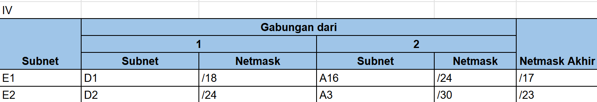
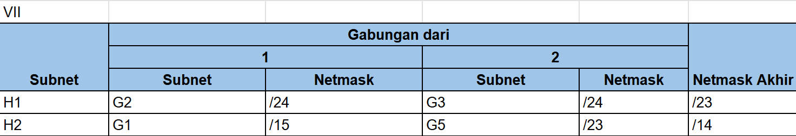

# Jarkom-Modul-4-IT24-2024
| Nama | NRP |
| --------------------- | ----------------------- |
| Monika Damelia Hutapea | 5027221011 |
| Naufan Zaki Lugmanulhakim | 5027221065 |

# PKT CIDR Topology

# GNS3 VLSM Topology

# IP Prefix
IP Prefix yang digunakan oleh kelompok kami adalah
`192.245`

# Jumlah IP Berdasarkan Subnet Mask
| Subnet Mask      | CIDR Notation | Jumlah IP yang Tersedia | Jumlah IP yang Dapat Digunakan |
|------------------|---------------|-------------------------|--------------------------------|
| 255.255.255.0    | /24           | 256                     | 254                            |
| 255.255.255.128  | /25           | 128                     | 126                            |
| 255.255.255.192  | /26           | 64                      | 62                             |
| 255.255.255.224  | /27           | 32                      | 30                             |
| 255.255.255.240  | /28           | 16                      | 14                             |
| 255.255.255.248  | /29           | 8                       | 6                              |
| 255.255.255.252  | /30           | 4                       | 2                              |

# Rute

# CIDR
## Penggabungan IP

### Kondisi node awal (A)

### Kondisi node setelah penggabungan pertama (B)

### Kondisi node setelah penggabungan kedua (C)

### Kondisi node setelah penggabungan ketiga (D)

### Kondisi node setelah penggabungan keempat (E)

### Kondisi node setelah penggabungan kelima(F)

### Kondisi node setelah penggabungan keenam (G)

### Kondisi node setelah penggabungann ketujuh (H)

### Kondisi node setelah penggabungan kedelapan (I)

### Kondisi node setelah penggabungan kesembilan (J)

### Kondisi node setelah penggabungan kesepuluh (K)

## Tree

## Testing
