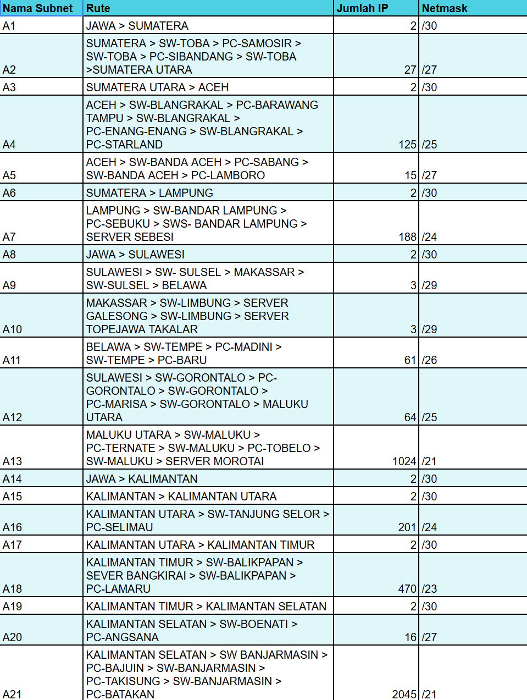
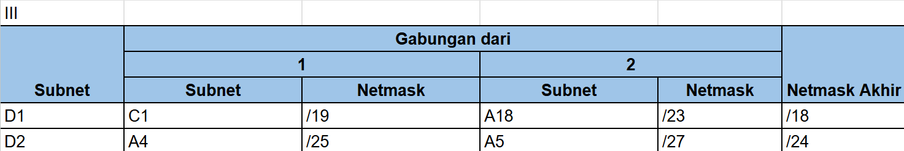
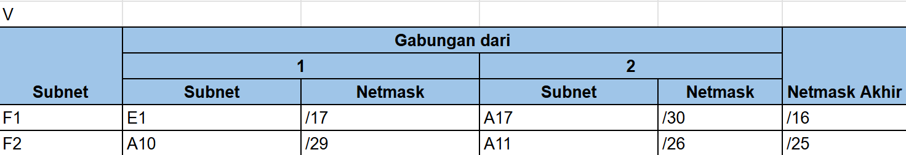
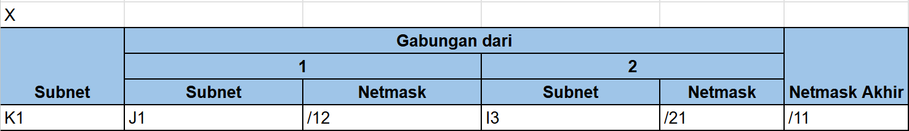

# Jarkom-Modul-4-IT24-2024
| Nama | NRP |
| --------------------- | ----------------------- |
| Monika Damelia Hutapea | 5027221011 |
| Naufan Zaki Lugmanulhakim | 5027221065 |

# VLSM 


# Pembagian IP VLSM


# Rute


# Konfigurasi

```

# JAWA (A1, A8, A14)
auto lo
iface lo inet loopback
up iptables -t nat -A POSTROUTING -o eth0 -j MASQUERADE -s 192.245.0.0/19
auto eth0
iface eth0 inet dhcp

# A1 (eth1 = Sumatera)
auto eth1
iface eth1 inet static
	address 192.245.20.177		#NID +1
	netmask 255.255.255.252

# A8 (eth2 = Sulawesi) 
auto eth2
iface eth2 inet static
	address 192.245.20.189		#NID +1
	netmask 255.255.255.252

# A14 (eth3 = Kalimantan) 
auto eth3
iface eth3 inet static
	address 192.245.20.193		#NID +1
	netmask 255.255.255.252

# SUMATERA (A1, A2, A6)

# A1 (eth0 = JAWA) 
auto eth0
iface eth0 inet static
	address 192.245.20.178
	netmask 255.255.255.252
        gateway 192.245.20.177	#eth 1 JAWA

# A2 (eth1 = SUMATERA UTARA) 
auto eth1
iface eth1 inet static
	address 192.245.20.65
	netmask 255.255.255.224

# A6 (eth2 = LAMPUNG) *
auto eth2
iface eth2 inet static
	address 192.245.20.185
	netmask 255.255.255.252

# Samosir (A2) 
auto eth0
iface eth0 inet static
	address 192.245.20.66
	netmask 255.255.255.224
	gateway 192.245.20.65  #eth 1 SUMATERA(router sebelumnya)

# Sibandang (A2) 
auto eth0
iface eth0 inet static
	address 192.245.20.67
	netmask 255.255.255.224
	gateway 192.245.20.65  #eth 1 SUMATERA(router sebelumnya)

# LAMPUNG ( A6 - A7 ) 
# A6 (eth0 = SUMATERA) 
auto eth0
iface eth0 inet static
	address 192.245.20.186
	netmask 255.255.255.252
        gateway 192.245.20.185   #eth 2 SUMATERA

# A7 (eth1 = pc sebuku, server sebesi ) 
auto eth1
iface eth1 inet static
	address 192.245.18.1
	netmask 255.255.255.0

# Sebuku (A7) 
auto eth0
iface eth0 inet static
	address 192.245.18.2
	netmask 255.255.255.0
	gateway 192.245.18.1  #eth 1 LAMPUNG

# Sebesi (A7) 
auto eth0
iface eth0 inet static
	address 192.245.18.3
	netmask 255.255.255.0
	gateway 192.245.18.1  #eth 1 LAMPUNG

# SUMATERA-UTARA (A2, A4)

# A2 (eth0 = SUMATERA)
auto eth0
iface eth0 inet static
	address 192.245.20.68
	netmask 255.255.255.224
        gateway 192.245.20.65   #eth 1  SUMATERA

# A3 (eth1 = ACEH) 
auto eth1
iface eth1 inet static
	address 192.245.20.181
	netmask 255.255.255.252

# ACEH (A3, A4, A5)
# A3
auto eth0 (eth0 = SUMATERA UTARA) 
iface eth0 inet static
	address 192.245.20.182 
	netmask 255.255.255.252
        gateway 192.245.20.181   #eth 1 SUMATERA-UTARA

# A4 (eth1 = PC BARAWANG TAMPU, ENANG2, STARLAND)
auto eth1
iface eth1 inet static
	address 192.245.19.1
	netmask 255.255.255.128

# A5 (eth2 = PC SABANG, LAMBORO)
auto eth2 
iface eth2 inet static
	address 192.245.20.129
	netmask 255.255.255.224

# Berawang-Tampu (A4) 
auto eth0
iface eth0 inet static
	address 192.245.19.2
	netmask 255.255.255.128
        gateway 192.245.19.1   #eth 1 ACEH

# Enang-Enang (A4) 
auto eth0
iface eth0 inet static
	address 192.245.19.3
	netmask 255.255.255.128
        gateway 192.245.19.1   #eth 1 ACEH

# Starland (A4)
auto eth0
iface eth0 inet static
	address 192.245.19.4
	netmask 255.255.255.128
        gateway 192.245.19.1   #eth 1 ACEH

# Sabang (A5)
auto eth0
iface eth0 inet static
	address 192.245.20.130
	netmask 255.255.255.224
        gateway 192.245.20.129   #eth 2 ACEH

# Lambaro (A5)
auto eth0
iface eth0 inet static
	address 192.245.20.131
	netmask 255.255.255.224
        gateway 192.245.20.129   #eth 2 ACEH

# KALIMANTAN ( A14 - A15 )

# A14 (eth0= JAWA)
auto eth0
iface eth0 inet static
	address 192.245.20.194
	netmask 255.255.255.252
        gateway 192.245.20.193   #eth 3 JAWA

# A15 (eth1= KALIMANTAN UTARA)
auto eth1
iface eth1 inet static
	address 192.245.20.197
	netmask 255.255.255.252

# KALIMANTAN-UTARA (A15, A16, A17 )
# A15 (eth0= KALIMANTAN)
auto eth0
iface eth0 inet static
	address 192.245.20.198
	netmask 255.255.255.252
        gateway 192.245.20.197   #eth 1 KALIMANTAN

# A17 (eth1= SELIMAU)
auto eth1 
iface eth1 inet static
	address 192.245.17.1
	netmask 255.255.255.0

# A16 (eth2= KALIMANTAN TIMUR)
auto eth2
iface eth2 inet static
	address 192.245.20.201
	netmask 255.255.255.252

# Selimau (A17)
auto eth0
iface eth0 inet static
	address 192.245.17.2
	netmask 255.255.255.0
        gateway 192.245.17.1   #eth 1 KALIMANTAN-UTARA

# KALIMANTAN-TIMUR (A16, A18, A19)

# A16 (eth0= KALIMANTAN UTARA)
auto eth0
iface eth0 inet static
	address 192.245.20.202 
	netmask 255.255.255.252
        gateway 192.245.20.201  #eth 2 KALIMANTAN-UTARA

# A18 (eth1= SERVER BANGKIRAI, PC LAMARU)
auto eth1
iface eth1 inet static
	address 192.245.16.1
	netmask 255.255.254.0

# A19 (eth2= KALIMANTAN SELATAN)
auto eth2
iface eth2 inet static
	address 192.245.20.205
	netmask 255.255.255.252

# Bangkirai (A18)
auto eth0
iface eth0 inet static
	address 192.245.16.2
	netmask 255.255.254.0
        gateway 192.245.16.1   #eth1 KALIMANTAN-TIMUR

# Lamaru (A18)
auto eth0
iface eth0 inet static
	address 192.243.16.3
	netmask 255.255.254.0
        gateway 192.245.16.1   #eth1 KALIMANTAN-TIMUR

# KALIMANTAN-SELATAN (A19,20,21 )
# A19 (eth0= KALIMANTAN TIMUR)
auto eth0
iface eth0 inet static
	address 192.245.20.206
	netmask 255.255.255.252
        gateway 192.245.20.205   #eth 2 KALIMANTAN-TIMUR

# A20 (eth1= PC ANGSANA)
auto eth1
iface eth1 inet static
	address 192.245.20.97 
	netmask 255.255.255.224

# A21 (eth2= PC BAJUIN, TAKISUNG, BATAKAN)
auto eth2
iface eth2 inet static
	address 192.245.0.1
	netmask 255.255.248.0

# Angsana (A20)
auto eth0
iface eth0 inet static
	address 192.245.20.98
	netmask 255.255.255.224
        gateway 192.245.20.97 

# Bajuin (A21)
auto eth0
iface eth0 inet static
	address 192.245.0.2
	netmask 255.255.248.0
        gateway 192.245.0.1
        
# Takisung (A21)
auto eth0
iface eth0 inet static
	address 192.245.0.3
	netmask 255.255.248.0
        gateway 192.245.0.1
        
# Batakan (A21)
auto eth0
iface eth0 inet static
	address 192.245.0.4
	netmask 255.255.248.0
        gateway 192.245.0.1

# SULAWESI (A8, 9, 12)

# A8 (eth0= JAWA)
auto eth0
iface eth0 inet static
	address 192.245.20.190
	netmask 255.255.255.252
        gateway 192.245.20.189   #eth 2 JAWA

# A9 (eth1= MAKASSAR, SERVER GALESONG, SERVER TOPEJAWA)
auto eth1
iface eth1 inet static
	address 192.245.20.161 
	netmask 255.255.255.248

# A12 (eth2= PC GORONTALO, MARISA)
auto eth2
iface eth2 inet static
	address 192.245.19.129
	netmask 255.255.255.128

# MAKASAR (A9, A10)
# A9 (eth0= SULAWESI)
auto eth0
iface eth0 inet static
	address 192.245.20.162
	netmask 255.255.255.248
        gateway 192.245.20.161    #eth 1 SULAWESI

# A10 (eth1= SERVER GALESONG, SERVER TOPEJAWA)
auto eth1
iface eth1 inet static
	address 192.245.20.169
	netmask 255.255.255.248

# Galesong (A10) 
auto eth0
iface eth0 inet static
	address 192.245.20.170
	netmask 255.255.255.248
        gateway 192.245.20.169

# Topejawa-Takalar (A10) 
auto eth0
iface eth0 inet static
	address 192.245.20.171
	netmask 255.255.255.248
        gateway 192.245.20.169

# BELAWA (A9, 11)

# A9 (eth0= SULAWESI)
auto eth0
iface eth0 inet static
	address 192.245.20.163
	netmask 255.255.255.248
        gateway 192.245.20.161    #eth 1 SULAWESI

# A11 (eth1= PC MADINI, BARU)
auto eth1
iface eth1 inet static
	address 192.245.20.1 
	netmask 255.255.255.192


# Madini (A11)
auto eth0
iface eth0 inet static
	address 192.245.20.2
	netmask 255.255.255.192
        gateway 192.245.20.1    #eth 1 BELAWA

# Baru (A11) 
auto eth0
iface eth0 inet static
	address 192.245.20.3
	netmask 255.255.255.192
        gateway 192.245.20.1   #eth 1 BELAWA

# Gorontalo (A12)
auto eth0
iface eth0 inet static
	address 192.245.19.130
	netmask 255.255.255.128
        gateway 192.245.19.129 #eth2 SULAWESI
 

# Marisa (A12)
auto eth0
iface eth0 inet static
	address 192.245.19.131
	netmask 255.255.255.128
        gateway 192.245.19.129  #eth2 SULAWESI

# MALUKU-UTARA (A12)

# A12 (eth0= SULAWESI)
auto eth0
iface eth0 inet static
	address 192.245.19.132
	netmask 255.255.255.128
        gateway 192.245.19.129

# A13 (eth1= PC TOBELO,TERNATE, SERVER MOROTAI)
auto eth1
iface eth1 inet static
	address 192.245.8.1
	netmask 255.255.248.0

# Tobelo (A13)
auto eth0
iface eth0 inet static
	address 192.245.8.2
	netmask 255.255.248.0
        gateway 192.245.8.1

# Morotai (A13)
auto eth0
iface eth0 inet static
	address 192.245.8.3
	netmask 255.255.248.0
        gateway 192.245.8.1

# Ternate (A13)
auto eth0
iface eth0 inet static
	address 192.245.8.4
	netmask 255.255.248.0
        gateway 192.245.8.1

```

# Routing

**1. ACEH**

### KE SUMATERA UTARA
```
route add -net 0.0.0.0 netmask 0.0.0.0 gw 192.245.20.181
```

**2. LAMPUNG**

### KE SUMATERA
```
route add -net 0.0.0.0 netmask 0.0.0.0 gw 192.245.20.185
```

**3. KALIMANTAN SELATAN**

### KE KALIMANTAN-TIMUR
```
route add -net 0.0.0.0 netmask 0.0.0.0 gw 192.245.20.205(198)
```

**4. MAKASSAR**

### KE SULAWESI
```
route add -net 0.0.0.0 netmask 0.0.0.0 gw 192.245.20.162
```

**5. BELAWA**

### KE SULAWESI
```
route add -net 0.0.0.0 netmask 0.0.0.0 gw 192.245.20.163 (190)
```

**6. MALUKU UTARA**
```
route add -net 0.0.0.0 netmask 0.0.0.0 gw 192.245.19.129
```

**7. SUMATERA UTARA**

```
route add -net 192.245.19.0 netmask 255.255.255.128 gw 192.245.20.182 #SW-BLANGKARAI
route add -net 192.245.20.128 netmask 255.255.255.224 gw 192.245.20.182 #SW-BANDA-ACEH
```

**8. SUMATERA**

### KE JAWA
```
route add -net 0.0.0.0 netmask 0.0.0.0 gw 192.245.20.177
```

### KE SUMATERA-UTARA
```
route add -net 192.245.20.180 netmask 255.255.255.252 gw 192.245.20.68
route add -net 192.245.19.0 netmask 255.255.255.128 gw 192.245.20.68
route add -net 192.245.20.128 netmask 255.255.255.224 gw 192.245.20.68
```

### KE LAMPUNG
```
route add -net 192.245.18.0 netmask 255.255.255.0 gw 192.245.20.186
```

**9. KALIMANTAN TIMUR**

```
route add -net 192.245.20.96 netmask 255.255.255.224 gw 192.245.20.206
route add -net 192.245.0.0 netmask 255.255.248.0 gw 192.245.20.206
```

**10. KALIMANTAN UTARA**

```
route add -net 192.245.16.0 netmask 255.255.254.0 gw 192.245.20.201
route add -net 192.245.20.204 netmask 255.255.255.252 gw 192.245.20.201
route add -net 192.245.20.96 netmask 255.255.255.224 gw 192.245.20.201
route add -net 192.245.0.0 netmask 255.255.248.0 gw 192.245.20.201
```

**11. KALIMANTAN**

```
route add -net 192.245.20.200 netmask 255.255.255.252 gw 192.245.20.198
route add -net 192.245.16.0 netmask 255.255.254.0 gw 192.245.20.198
route add -net 192.245.20.204 netmask 255.255.255.252 gw 192.245.20.198
route add -net 192.245.20.96 netmask 255.255.255.224 gw 192.245.20.198
route add -net 192.245.0.0 netmask 255.255.248.0 gw 192.245.20.198
```

**12. SULAWESI**

### KE MALUKU-UTARA
```
route add -net 192.245.8.0 netmask 255.255.248.0 gw 192.245.19.132
```

### KE MAKASAR
```
route add -net 192.245.20.168 netmask 255.255.255.248 gw 192.245.20.162
```

### KE BELAWA

```
route add -net 192.245.20.160 netmask 255.255.255.248 gw 192.245.20.163
```

**13. JAWA**

### Ke arah ke SUMATERA

```
route add -net 192.245.20.184 netmask 255.255.255.252 gw 192.245.20.178
route add -net 192.245.18.0 netmask 255.255.255.0 gw 192.245.20.178
route add -net 192.245.20.64 netmask 255.255.255.224 gw 192.245.20.178
route add -net 192.245.20.180 netmask 255.255.255.252 gw 192.245.20.178
route add -net 192.245.19.0 netmask 255.255.255.128 gw 192.245.20.178
route add -net 192.245.20.128 netmask 255.255.255.224 gw 192.245.20.178
```

### Ke arah KALIMANTAN

```
route add -net 192.245.20.196 netmask 255.255.255.252 gw 192.245.20.194
route add -net 192.245.17.0 netmask 255.255.255.0 gw 192.245.20.194
route add -net 192.245.20.200 netmask 255.255.255.252 gw 192.245.20.194
route add -net 192.245.16.0 netmask 255.255.254.0 gw 192.245.20.194
route add -net 192.245.20.204 netmask 255.255.255.252 gw 192.245.20.194
route add -net 192.245.20.96 netmask 255.255.255.224 gw 192.245.20.194
route add -net 192.245.0.0 netmask 255.255.248.0 gw 192.245.20.194
```

### Ke arah SULAWESI

```
route add -net 192.245.20.160 netmask 255.255.255.248 gw 192.245.20.190
route add -net 192.245.20.168 netmask 255.255.255.248 gw 192.245.20.190
route add -net 192.245.20.0 netmask 255.255.255.192 gw 192.245.20.190
route add -net 192.245.19.128 netmask 255.255.255.128 gw 192.245.20.190
route add -net 192.245.8.0 netmask 255.255.248.0 gw 192.245.20.190
```

# Testing

https://github.com/NaufanZaki/Jarkom-Modul-4-IT24-2024/assets/124648489/b91a235b-378e-4dae-a7ea-22ad7867aa89


# PKT CIDR Topology

# GNS3 VLSM Topology

# IP Prefix
IP Prefix yang digunakan oleh kelompok kami adalah
`192.245`

# Jumlah IP Berdasarkan Subnet Mask
| Subnet Mask      | CIDR Notation | Jumlah IP yang Tersedia | Jumlah IP yang Dapat Digunakan |
|------------------|---------------|-------------------------|--------------------------------|
| 255.255.255.0    | /24           | 256                     | 254                            |
| 255.255.255.128  | /25           | 128                     | 126                            |
| 255.255.255.192  | /26           | 64                      | 62                             |
| 255.255.255.224  | /27           | 32                      | 30                             |
| 255.255.255.240  | /28           | 16                      | 14                             |
| 255.255.255.248  | /29           | 8                       | 6                              |
| 255.255.255.252  | /30           | 4                       | 2                              |

# Rute


# CIDR
## Penggabungan IP

### Kondisi node awal (A)


### Kondisi node setelah penggabungan pertama (B)


### Kondisi node setelah penggabungan kedua (C)


### Kondisi node setelah penggabungan ketiga (D)


### Kondisi node setelah penggabungan keempat (E)


### Kondisi node setelah penggabungan kelima(F)


### Kondisi node setelah penggabungan keenam (G)


### Kondisi node setelah penggabungann ketujuh (H)


### Kondisi node setelah penggabungan kedelapan (I)


### Kondisi node setelah penggabungan kesembilan (J)


### Kondisi node setelah penggabungan kesepuluh (K)


## Tree

## Testing
